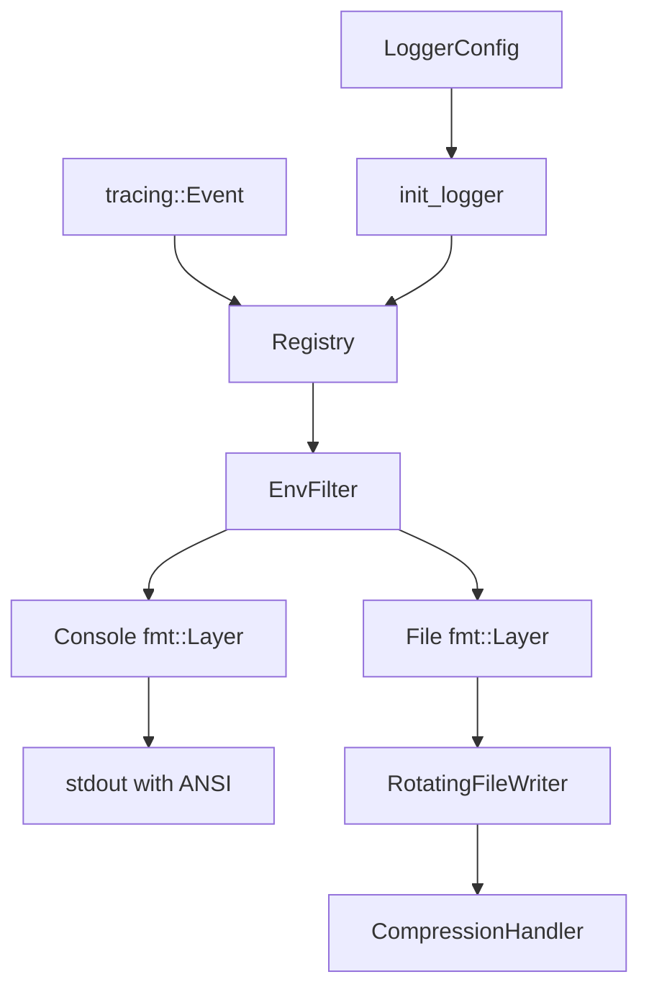

# Design Document: Advanced Logger

## Overview

本设计文档描述了一个基于 `tracing-subscriber` 的高级日志系统。该系统充分利用 `tracing-subscriber` 现有的 Layer 系统和格式化器，仅在必要时进行扩展（如文件轮转和压缩）。

## 设计原则

1. **最大化复用**：优先使用 `tracing-subscriber` 内置的 `fmt::Layer`
2. **最小化自定义**：只在必要时实现自定义组件（轮转 Writer、压缩）
3. **组合优于继承**：通过组合现有 Layer 实现功能

## Architecture



## 核心实现策略

### 1. 控制台输出 - 直接使用 fmt::Layer

```rust
use tracing_subscriber::fmt;

// 控制台层：直接使用内置的 fmt::Layer
let console_layer = fmt::layer()
    .with_ansi(config.console.colored && is_tty())
    .with_target(true)
    .with_level(true)
    .with_writer(std::io::stdout);
```

### 2. 文件输出 - fmt::Layer + 自定义 Writer

```rust
use tracing_subscriber::fmt;

// 文件层：使用 fmt::Layer 配合自定义 Writer
let file_layer = fmt::layer()
    .with_ansi(false)  // 文件不需要颜色
    .with_writer(RotatingFileWriter::new(config.file.clone())?)
    .with_target(true);

// 根据格式选择不同的格式化器
match config.file.format {
    LogFormat::Full => file_layer,
    LogFormat::Compact => file_layer.compact(),
    LogFormat::Json => file_layer.json(),
}
```

### 3. 轮转 - 自定义 MakeWriter

只需实现 `MakeWriter` trait，其他格式化逻辑完全由 `fmt::Layer` 处理：

```rust
pub struct RotatingFileWriter {
    config: FileConfig,
    state: Arc<Mutex<WriterState>>,
}

struct WriterState {
    current_file: BufWriter<File>,
    current_size: u64,
    file_count: usize,
}

impl<'a> MakeWriter<'a> for RotatingFileWriter {
    type Writer = RotatingWriterGuard;
    
    fn make_writer(&'a self) -> Self::Writer {
        // 检查是否需要轮转，返回 writer guard
    }
}
```

## Components and Interfaces

### 主要初始化接口

```rust
use tracing_subscriber::{layer::SubscriberExt, util::SubscriberInitExt, EnvFilter};

/// 初始化日志系统
pub fn init_logger(config: LoggerConfig) -> anyhow::Result<()> {
    config.validate()?;
    
    let filter = EnvFilter::try_new(&config.level)?;
    
    let registry = tracing_subscriber::registry().with(filter);
    
    // 添加控制台层
    let registry = if config.console.enabled {
        let console = build_console_layer(&config.console);
        registry.with(console)
    } else {
        registry.with(None::<fmt::Layer<_>>)
    };
    
    // 添加文件层
    let registry = if config.file.enabled {
        let file = build_file_layer(&config.file)?;
        registry.with(file)
    } else {
        registry.with(None::<fmt::Layer<_>>)
    };
    
    registry.init();
    Ok(())
}
```

### 控制台层构建

```rust
fn build_console_layer<S>(config: &ConsoleConfig) -> impl Layer<S>
where
    S: Subscriber + for<'a> LookupSpan<'a>,
{
    let is_tty = std::io::stdout().is_terminal();
    let use_ansi = config.colored && is_tty;
    
    fmt::layer()
        .with_ansi(use_ansi)
        .with_target(true)
        .with_level(true)
        .with_writer(std::io::stdout)
}
```

### 文件层构建

```rust
fn build_file_layer<S>(config: &FileConfig) -> anyhow::Result<Box<dyn Layer<S> + Send + Sync>>
where
    S: Subscriber + for<'a> LookupSpan<'a>,
{
    let writer = RotatingFileWriter::new(config)?;
    
    let base_layer = fmt::layer()
        .with_ansi(false)
        .with_target(true)
        .with_writer(writer);
    
    // 根据格式返回不同的层
    match config.format {
        LogFormat::Full => Ok(Box::new(base_layer)),
        LogFormat::Compact => Ok(Box::new(base_layer.compact())),
        LogFormat::Json => Ok(Box::new(base_layer.json())),
    }
}
```

### 轮转文件 Writer

```rust
use std::io::Write;
use tracing_subscriber::fmt::MakeWriter;

pub struct RotatingFileWriter {
    config: FileConfig,
    state: Arc<Mutex<WriterState>>,
}

struct WriterState {
    file: BufWriter<File>,
    current_size: u64,
    rotation_manager: RotationManager,
}

impl RotatingFileWriter {
    pub fn new(config: FileConfig) -> anyhow::Result<Self>;
}

impl<'a> MakeWriter<'a> for RotatingFileWriter {
    type Writer = RotatingWriterGuard<'a>;
    
    fn make_writer(&'a self) -> Self::Writer {
        RotatingWriterGuard { writer: self }
    }
}

pub struct RotatingWriterGuard<'a> {
    writer: &'a RotatingFileWriter,
}

impl Write for RotatingWriterGuard<'_> {
    fn write(&mut self, buf: &[u8]) -> io::Result<usize> {
        let mut state = self.writer.state.lock().unwrap();
        
        // 检查是否需要轮转
        if state.rotation_manager.should_rotate(state.current_size) {
            state.rotation_manager.rotate(&self.writer.config.path)?;
            // 重新打开文件
            state.file = open_log_file(&self.writer.config)?;
            state.current_size = 0;
        }
        
        let written = state.file.write(buf)?;
        state.current_size += written as u64;
        Ok(written)
    }
    
    fn flush(&mut self) -> io::Result<()> {
        self.writer.state.lock().unwrap().file.flush()
    }
}
```

### 轮转管理器

```rust
pub struct RotationManager {
    config: RotationConfig,
    compression_handler: CompressionHandler,
}

impl RotationManager {
    pub fn new(config: RotationConfig) -> Self;
    
    pub fn should_rotate(&self, current_size: u64) -> bool {
        match &self.config.strategy {
            RotationStrategy::Size => current_size >= self.config.max_size,
            RotationStrategy::Time(unit) => self.check_time_rotation(unit),
            RotationStrategy::Count => false, // Count-based handled differently
            RotationStrategy::Combined => {
                current_size >= self.config.max_size || self.check_time_rotation_default()
            }
        }
    }
    
    pub fn rotate(&mut self, base_path: &Path) -> io::Result<()> {
        // 1. 重命名当前文件（添加时间戳或序号）
        // 2. 如果启用压缩，压缩旧文件
        // 3. 清理超出数量限制的旧文件
    }
}
```

### 压缩处理器

```rust
use flate2::write::GzEncoder;
use flate2::Compression;

pub struct CompressionHandler {
    enabled: bool,
}

impl CompressionHandler {
    pub fn new(enabled: bool) -> Self {
        Self { enabled }
    }
    
    pub fn compress_file(&self, path: &Path) -> anyhow::Result<()> {
        if !self.enabled {
            return Ok(());
        }
        
        let input = std::fs::read(path)?;
        let output_path = path.with_extension("log.gz");
        
        let output_file = File::create(&output_path)?;
        let mut encoder = GzEncoder::new(output_file, Compression::default());
        encoder.write_all(&input)?;
        encoder.finish()?;
        
        std::fs::remove_file(path)?;
        Ok(())
    }
}
```

## 配置系统

配置结构保持不变，但简化了验证逻辑：

```rust
#[derive(Debug, Clone)]
pub struct LoggerConfig {
    pub console: ConsoleConfig,
    pub file: FileConfig,
    pub level: String,  // 支持 EnvFilter 语法，如 "info,my_crate=debug"
}

#[derive(Debug, Clone)]
pub struct ConsoleConfig {
    pub enabled: bool,
    pub colored: bool,  // 会自动检测 TTY
}

#[derive(Debug, Clone)]
pub struct FileConfig {
    pub enabled: bool,
    pub path: PathBuf,
    pub append: bool,
    pub format: LogFormat,
    pub rotation: RotationConfig,
}

#[derive(Debug, Clone)]
pub enum LogFormat {
    Full,     // 使用 fmt::layer() 默认格式
    Compact,  // 使用 fmt::layer().compact()
    Json,     // 使用 fmt::layer().json()
}

#[derive(Debug, Clone)]
pub struct RotationConfig {
    pub strategy: RotationStrategy,
    pub max_size: u64,
    pub max_files: usize,
    pub compress: bool,
}
```

## 与原设计的对比

| 方面 | 原设计 | 新设计 |
|------|--------|--------|
| 控制台格式化 | 自定义 ConsoleFormatter | 使用 fmt::Layer 内置格式化 |
| 文件格式化 | 自定义 FileFormatter | 使用 fmt::Layer 的 compact()/json() |
| 颜色处理 | 自定义颜色代码 | 使用 with_ansi() |
| 事件处理 | 自定义 on_event | 完全由 fmt::Layer 处理 |
| 轮转 | 自定义 Layer | 自定义 MakeWriter（更简单） |
| 代码量 | ~1000+ 行 | ~300 行 |

## Error Handling

使用 `anyhow` 进行错误处理，主要错误场景：

```rust
#[derive(Debug, thiserror::Error)]
pub enum LoggerError {
    #[error("IO error: {0}")]
    Io(#[from] std::io::Error),
    
    #[error("Configuration error: {message}")]
    Config { message: String },
    
    #[error("Rotation error: {message}")]
    Rotation { message: String },
    
    #[error("Compression error: {message}")]
    Compression { message: String },
}
```

## Testing Strategy

测试策略保持不变，但测试重点转移到：

1. **配置验证测试**：确保配置正确传递给 fmt::Layer
2. **轮转逻辑测试**：测试 RotatingFileWriter 的轮转行为
3. **压缩功能测试**：测试 CompressionHandler
4. **集成测试**：验证完整的日志流程

## 使用示例

```rust
use tracing::{info, error, warn, debug, instrument};
use advanced_logger::{LoggerConfig, ConsoleConfig, FileConfig, LogFormat, init_logger};

fn main() -> anyhow::Result<()> {
    // 初始化日志系统
    let config = LoggerConfig {
        console: ConsoleConfig {
            enabled: true,
            colored: true,
        },
        file: FileConfig {
            enabled: true,
            path: "logs/app.log".into(),
            append: true,
            format: LogFormat::Json,
            rotation: RotationConfig::default(),
        },
        level: "info,my_crate=debug".to_string(),
    };

    init_logger(config)?;

    // 使用标准 tracing 宏
    info!("Application started");
    error!("An error occurred: {}", "something went wrong");
    warn!(user_id = 123, "User action failed");
    debug!("Debug information");
    
    // 使用 span
    do_work();
    
    Ok(())
}

#[instrument]
fn do_work() {
    info!("Doing some work");
}
```

## 依赖

```toml
[dependencies]
tracing = "0.1"
tracing-subscriber = { version = "0.3", features = ["fmt", "json", "env-filter"] }
anyhow = "1.0"
thiserror = "2.0"
chrono = { version = "0.4", features = ["serde"] }
flate2 = "1.0"

[dev-dependencies]
proptest = "1.0"
tempfile = "3.0"
tracing-test = "0.2"
```
