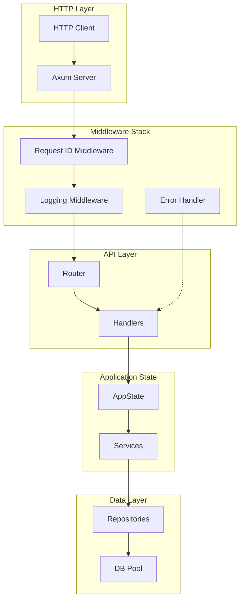

# Design Document: Axum Integration

## Overview

本设计文档描述了将 Axum Web 框架集成到 fusion-rs 项目中的技术方案。主要包括：

1. **AppState** - 封装 Services 的应用状态
2. **API 路由层** - 路由注册和请求处理器
3. **中间件层** - 请求日志、请求追踪 ID、全局错误处理
4. **DTO 层** - API 请求和响应的数据传输对象

## Architecture



## Components and Interfaces

### 1. AppState

应用状态结构，包含所有共享服务。

```rust
/// Application state containing all shared services.
/// 
/// This struct is designed to be used with Axum's State extractor.
/// Cloning is cheap since Services uses Arc internally.
#[derive(Clone)]
pub struct AppState {
    pub services: Services,
}

impl AppState {
    /// Creates a new AppState from a database connection pool.
    pub async fn new(pool: AsyncDbPool) -> Self {
        let repos = Repositories::new(pool);
        let services = Services::new(repos);
        Self { services }
    }
}
```

### 2. Router Module (`src/api/routes.rs`)

集中管理所有路由注册。

```rust
use axum::{Router, middleware};
use crate::api::handlers;
use crate::api::middleware::{logging_middleware, request_id_middleware};
use crate::AppState;

/// Creates the main application router with all routes and middleware.
pub fn create_router(state: AppState) -> Router {
    let api_routes = Router::new()
        .nest("/users", handlers::users::user_routes());
    
    Router::new()
        .nest("/api", api_routes)
        .layer(middleware::from_fn(logging_middleware))
        .layer(middleware::from_fn(request_id_middleware))
        .with_state(state)
}
```

### 3. User Handlers (`src/api/handlers/users.rs`)

用户 CRUD 操作的请求处理器。

```rust
use axum::{
    extract::{Path, State},
    http::StatusCode,
    routing::{get, post, put, delete},
    Json, Router,
};
use crate::api::dto::{CreateUserRequest, UpdateUserRequest, UserResponse, ErrorResponse};
use crate::AppState;
use crate::error::AppError;

/// Creates user-related routes.
pub fn user_routes() -> Router<AppState> {
    Router::new()
        .route("/", get(list_users).post(create_user))
        .route("/:id", get(get_user).put(update_user).delete(delete_user))
}

/// GET /api/users - List all users
async fn list_users(
    State(state): State<AppState>,
) -> Result<Json<Vec<UserResponse>>, AppError> {
    let users = state.services.users.list_users().await?;
    let responses: Vec<UserResponse> = users.into_iter().map(UserResponse::from).collect();
    Ok(Json(responses))
}

/// GET /api/users/:id - Get user by ID
async fn get_user(
    State(state): State<AppState>,
    Path(id): Path<i32>,
) -> Result<Json<UserResponse>, AppError> {
    let user = state.services.users.get_user(id).await?;
    Ok(Json(UserResponse::from(user)))
}

/// POST /api/users - Create new user
async fn create_user(
    State(state): State<AppState>,
    Json(payload): Json<CreateUserRequest>,
) -> Result<(StatusCode, Json<UserResponse>), AppError> {
    let new_user = payload.into_new_user();
    let user = state.services.users.create_user(new_user).await?;
    Ok((StatusCode::CREATED, Json(UserResponse::from(user))))
}

/// PUT /api/users/:id - Update user
async fn update_user(
    State(state): State<AppState>,
    Path(id): Path<i32>,
    Json(payload): Json<UpdateUserRequest>,
) -> Result<Json<UserResponse>, AppError> {
    let update_data = payload.into_update_user();
    let user = state.services.users.update_user(id, update_data).await?;
    Ok(Json(UserResponse::from(user)))
}

/// DELETE /api/users/:id - Delete user
async fn delete_user(
    State(state): State<AppState>,
    Path(id): Path<i32>,
) -> Result<StatusCode, AppError> {
    state.services.users.delete_user(id).await?;
    Ok(StatusCode::NO_CONTENT)
}
```

### 4. Request ID Middleware (`src/api/middleware/request_id.rs`)

为每个请求生成或传递唯一追踪 ID。

```rust
use axum::{
    extract::Request,
    http::{HeaderName, HeaderValue},
    middleware::Next,
    response::Response,
};
use uuid::Uuid;

pub const REQUEST_ID_HEADER: &str = "x-request-id";

/// Request ID stored in request extensions.
#[derive(Clone, Debug)]
pub struct RequestId(pub String);

/// Middleware that ensures every request has a unique request ID.
pub async fn request_id_middleware(mut request: Request, next: Next) -> Response {
    // Get existing request ID from header or generate new one
    let request_id = request
        .headers()
        .get(REQUEST_ID_HEADER)
        .and_then(|v| v.to_str().ok())
        .map(String::from)
        .unwrap_or_else(|| Uuid::new_v4().to_string());
    
    // Store in request extensions for downstream access
    request.extensions_mut().insert(RequestId(request_id.clone()));
    
    // Process request
    let mut response = next.run(request).await;
    
    // Add request ID to response headers
    if let Ok(value) = HeaderValue::from_str(&request_id) {
        response.headers_mut().insert(
            HeaderName::from_static(REQUEST_ID_HEADER),
            value,
        );
    }
    
    response
}
```

### 5. Logging Middleware (`src/api/middleware/logging.rs`)

记录请求和响应日志。

```rust
use axum::{extract::Request, middleware::Next, response::Response};
use std::time::Instant;
use tracing::{info, span, Level};
use crate::api::middleware::request_id::RequestId;

/// Middleware that logs request and response information.
pub async fn logging_middleware(request: Request, next: Next) -> Response {
    let method = request.method().clone();
    let uri = request.uri().clone();
    let request_id = request
        .extensions()
        .get::<RequestId>()
        .map(|r| r.0.clone())
        .unwrap_or_else(|| "unknown".to_string());
    
    let span = span!(
        Level::INFO,
        "http_request",
        method = %method,
        uri = %uri,
        request_id = %request_id
    );
    let _enter = span.enter();
    
    info!(method = %method, path = %uri.path(), request_id = %request_id, "Request received");
    
    let start = Instant::now();
    let response = next.run(request).await;
    let duration = start.elapsed();
    
    info!(
        status = %response.status().as_u16(),
        duration_ms = %duration.as_millis(),
        request_id = %request_id,
        "Response sent"
    );
    
    response
}
```

### 6. Error Handler (`src/api/middleware/error_handler.rs`)

将 AppError 转换为 HTTP 响应。

```rust
use axum::{
    http::StatusCode,
    response::{IntoResponse, Response},
    Json,
};
use crate::api::dto::ErrorResponse;
use crate::error::AppError;

impl IntoResponse for AppError {
    fn into_response(self) -> Response {
        let (status, error_response) = match &self {
            AppError::NotFound => (
                StatusCode::NOT_FOUND,
                ErrorResponse::new("NOT_FOUND", "Resource not found"),
            ),
            AppError::Database(e) => (
                StatusCode::INTERNAL_SERVER_ERROR,
                ErrorResponse::new("DATABASE_ERROR", &format!("Database error: {}", e)),
            ),
            AppError::Pool(_) => (
                StatusCode::SERVICE_UNAVAILABLE,
                ErrorResponse::new("SERVICE_UNAVAILABLE", "Database connection unavailable"),
            ),
            AppError::PoolBuild(_) => (
                StatusCode::INTERNAL_SERVER_ERROR,
                ErrorResponse::new("INTERNAL_ERROR", "Failed to initialize database pool"),
            ),
            AppError::Env(_) => (
                StatusCode::INTERNAL_SERVER_ERROR,
                ErrorResponse::new("CONFIGURATION_ERROR", "Missing environment configuration"),
            ),
        };
        
        (status, Json(error_response)).into_response()
    }
}
```

## Data Models

### Request DTOs

```rust
use serde::Deserialize;
use crate::models::{NewUser, UpdateUser};

/// Request body for creating a new user.
#[derive(Debug, Deserialize)]
pub struct CreateUserRequest {
    pub username: String,
    pub email: String,
    pub password: String,
}

impl CreateUserRequest {
    pub fn into_new_user(self) -> NewUser {
        NewUser {
            username: self.username,
            email: self.email,
            password: self.password,
        }
    }
}

/// Request body for updating a user.
#[derive(Debug, Deserialize)]
pub struct UpdateUserRequest {
    pub username: Option<String>,
    pub email: Option<String>,
    pub password: Option<String>,
}

impl UpdateUserRequest {
    pub fn into_update_user(self) -> UpdateUser {
        UpdateUser {
            username: self.username,
            email: self.email,
            password: self.password,
        }
    }
}
```

### Response DTOs

```rust
use chrono::NaiveDateTime;
use serde::Serialize;
use crate::models::User;

/// Response body for user data (excludes sensitive fields).
#[derive(Debug, Serialize)]
pub struct UserResponse {
    pub id: i32,
    pub username: String,
    pub email: String,
    pub created_at: String,
    pub updated_at: String,
}

impl From<User> for UserResponse {
    fn from(user: User) -> Self {
        Self {
            id: user.id,
            username: user.username,
            email: user.email,
            created_at: user.created_at.format("%Y-%m-%dT%H:%M:%S%.3fZ").to_string(),
            updated_at: user.updated_at.format("%Y-%m-%dT%H:%M:%S%.3fZ").to_string(),
        }
    }
}

/// Standard error response format.
#[derive(Debug, Serialize)]
pub struct ErrorResponse {
    pub code: String,
    pub message: String,
    #[serde(skip_serializing_if = "Option::is_none")]
    pub details: Option<String>,
    #[serde(skip_serializing_if = "Option::is_none")]
    pub request_id: Option<String>,
}

impl ErrorResponse {
    pub fn new(code: &str, message: &str) -> Self {
        Self {
            code: code.to_string(),
            message: message.to_string(),
            details: None,
            request_id: None,
        }
    }
    
    pub fn with_details(mut self, details: &str) -> Self {
        self.details = Some(details.to_string());
        self
    }
    
    pub fn with_request_id(mut self, request_id: &str) -> Self {
        self.request_id = Some(request_id.to_string());
        self
    }
}
```

## Correctness Properties

*A property is a characteristic or behavior that should hold true across all valid executions of a system—essentially, a formal statement about what the system should do. Properties serve as the bridge between human-readable specifications and machine-verifiable correctness guarantees.*

### Property 1: Request ID Consistency

*For any* HTTP request, if the request contains an X-Request-ID header, the response SHALL contain the same value; if the request does not contain the header, the response SHALL contain a valid UUID.

**Validates: Requirements 5.1, 5.2, 5.3**

### Property 2: UserResponse Password Exclusion

*For any* User model instance, when converted to UserResponse, the resulting JSON serialization SHALL NOT contain a "password" field.

**Validates: Requirements 8.1**

### Property 3: Timestamp ISO 8601 Format

*For any* User model with valid timestamps, when converted to UserResponse, the created_at and updated_at fields SHALL be formatted as ISO 8601 strings (YYYY-MM-DDTHH:MM:SS.sssZ).

**Validates: Requirements 8.3**

### Property 4: Error Status Code Mapping

*For any* AppError variant, when converted to an HTTP response, the status code SHALL match the expected mapping: NotFound → 404, Database → 500, Pool → 503.

**Validates: Requirements 6.1, 6.2, 6.3, 6.4**

### Property 5: Error Response Structure

*For any* AppError, when converted to an HTTP response, the response body SHALL be valid JSON containing at least "code" and "message" fields.

**Validates: Requirements 6.5**

## Error Handling

### Error Types and HTTP Status Codes

| AppError Variant | HTTP Status | Error Code |
|-----------------|-------------|------------|
| NotFound | 404 | NOT_FOUND |
| Database | 500 | DATABASE_ERROR |
| Pool | 503 | SERVICE_UNAVAILABLE |
| PoolBuild | 500 | INTERNAL_ERROR |
| Env | 500 | CONFIGURATION_ERROR |

### JSON Validation Errors

当请求体 JSON 解析失败时，Axum 会自动返回 400 Bad Request。我们可以通过自定义 rejection handler 来提供更详细的错误信息。

```rust
use axum::{
    extract::rejection::JsonRejection,
    response::{IntoResponse, Response},
};

pub async fn handle_json_rejection(rejection: JsonRejection) -> Response {
    let error = ErrorResponse::new("INVALID_JSON", &rejection.to_string());
    (StatusCode::BAD_REQUEST, Json(error)).into_response()
}
```

## Testing Strategy

### Unit Tests

单元测试用于验证各个组件的独立功能：

1. **DTO 转换测试** - 验证 User → UserResponse 转换正确排除密码字段
2. **错误映射测试** - 验证 AppError → HTTP 状态码映射
3. **Request ID 生成测试** - 验证 UUID 生成格式正确

### Property-Based Tests

使用 `proptest` 库进行属性测试，验证系统在各种输入下的行为一致性：

1. **Property 1**: Request ID 一致性 - 生成随机请求 ID，验证响应中包含相同值
2. **Property 2**: UserResponse 密码排除 - 生成随机 User，验证序列化结果不含密码
3. **Property 3**: 时间戳格式 - 生成随机时间戳，验证格式化结果符合 ISO 8601
4. **Property 4**: 错误状态码映射 - 生成各种 AppError，验证状态码正确
5. **Property 5**: 错误响应结构 - 生成各种 AppError，验证响应 JSON 结构

### Integration Tests

集成测试验证完整的请求-响应流程：

1. **CRUD 操作测试** - 使用 `axum::test` 模拟 HTTP 请求
2. **中间件测试** - 验证请求 ID 和日志中间件正常工作
3. **错误处理测试** - 验证各种错误场景返回正确响应

### Test Configuration

```rust
// Property-based tests should run at least 100 iterations
proptest! {
    #![proptest_config(ProptestConfig::with_cases(100))]
    
    // Feature: axum-integration, Property 2: UserResponse Password Exclusion
    #[test]
    fn prop_user_response_excludes_password(user in arb_user()) {
        let response = UserResponse::from(user);
        let json = serde_json::to_string(&response).unwrap();
        prop_assert!(!json.contains("password"));
    }
}
```

## File Structure

```
src/
├── api/
│   ├── mod.rs
│   ├── routes.rs
│   ├── handlers/
│   │   ├── mod.rs
│   │   └── users.rs
│   ├── middleware/
│   │   ├── mod.rs
│   │   ├── logging.rs
│   │   ├── request_id.rs
│   │   └── error_handler.rs
│   └── dto/
│       ├── mod.rs
│       ├── request.rs
│       └── response.rs
├── state.rs  (AppState)
└── main.rs   (updated)
```
