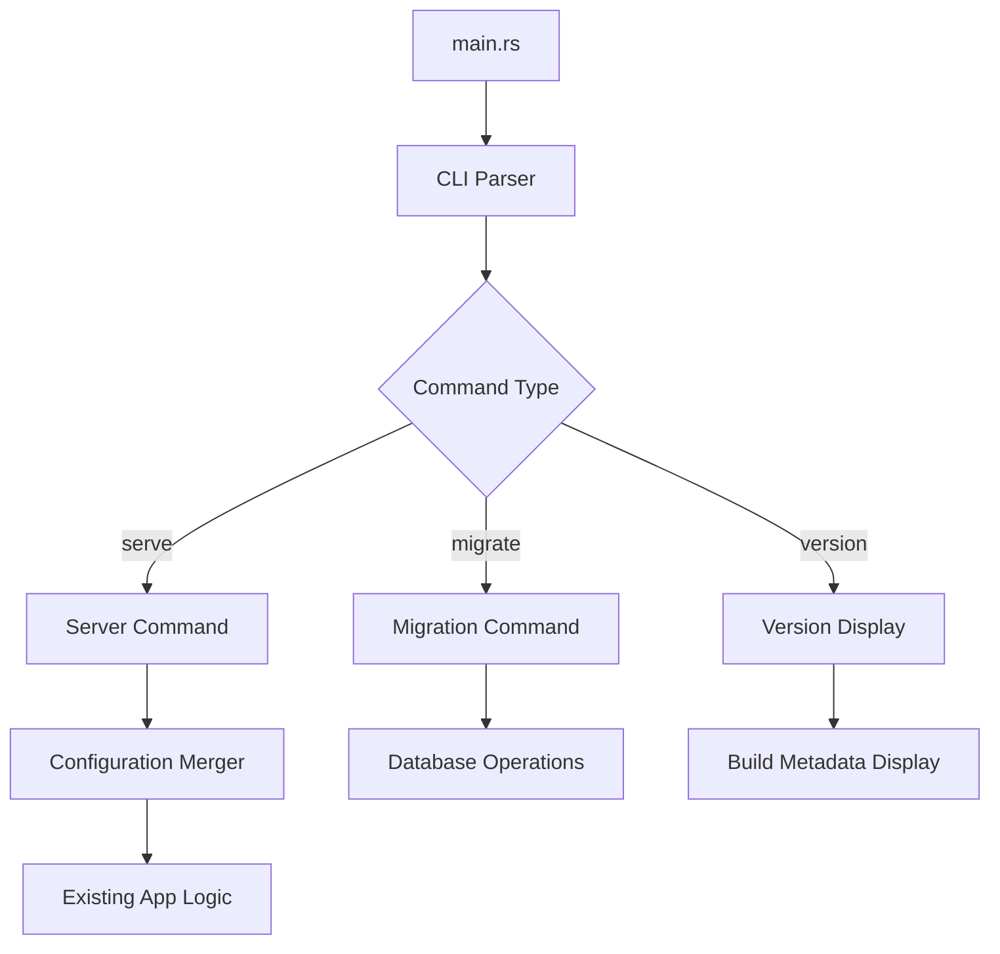

# Design Document: CLI Arguments

## Overview

This design implements command-line argument parsing for the Rust application using the clap library with derive macros for type-safe argument handling. The solution includes comprehensive version information using shadow-rs for build metadata, subcommands for database operations, and configuration override capabilities.

## Architecture

The CLI implementation follows a layered architecture:

1. **CLI Layer**: Handles argument parsing and validation using clap derive macros
2. **Command Dispatcher**: Routes parsed commands to appropriate handlers
3. **Configuration Integration**: Merges CLI arguments with existing configuration system
4. **Build Metadata**: Provides comprehensive version information via shadow-rs



## Components and Interfaces

### CLI Structure Definition

```rust
use clap::{Parser, Subcommand, ValueEnum};

#[derive(Parser)]
#[command(name = "fusion-rs")]
#[command(about = "A Rust web application with database integration")]
#[command(version = shadow_rs::CLAP_LONG_VERSION)]
pub struct Cli {
    #[command(subcommand)]
    pub command: Option<Commands>,
    
    /// Configuration file path
    #[arg(short, long, value_name = "FILE")]
    pub config: Option<PathBuf>,
    
    /// Override environment detection
    #[arg(short, long, value_enum)]
    pub env: Option<Environment>,
    
    /// Enable verbose logging
    #[arg(short, long)]
    pub verbose: bool,
    
    /// Suppress non-error output
    #[arg(short, long, conflicts_with = "verbose")]
    pub quiet: bool,
}

#[derive(Subcommand)]
pub enum Commands {
    /// Start the web server (default)
    Serve {
        /// Host address to bind to
        #[arg(long, value_name = "ADDRESS")]
        host: Option<String>,
        
        /// Port number to listen on
        #[arg(short, long, value_name = "PORT")]
        port: Option<u16>,
        
        /// Log level override
        #[arg(long, value_enum)]
        log_level: Option<LogLevel>,
        
        /// Validate configuration and exit
        #[arg(long)]
        dry_run: bool,
    },
    /// Database migration operations
    Migrate {
        /// Show pending migrations without applying
        #[arg(long)]
        dry_run: bool,
        
        /// Number of migrations to rollback
        #[arg(long, value_name = "STEPS")]
        rollback: Option<u32>,
    },
}

#[derive(ValueEnum, Clone)]
pub enum Environment {
    Development,
    Production,
    Test,
}

#[derive(ValueEnum, Clone)]
pub enum LogLevel {
    Error,
    Warn,
    Info,
    Debug,
    Trace,
}
```

### Configuration Integration

```rust
pub struct ConfigurationMerger {
    base_config: Settings,
}

impl ConfigurationMerger {
    pub fn new(base_config: Settings) -> Self {
        Self { base_config }
    }
    
    pub fn merge_cli_args(&mut self, cli: &Cli, serve_args: Option<&ServeArgs>) -> Result<Settings> {
        // Override configuration file path if provided
        if let Some(config_path) = &cli.config {
            // Reload configuration from specified path
        }
        
        // Override environment if provided
        if let Some(env) = &cli.env {
            // Set environment override
        }
        
        // Apply serve command specific overrides
        if let Some(serve) = serve_args {
            if let Some(host) = &serve.host {
                self.base_config.server.host = host.clone();
            }
            if let Some(port) = serve.port {
                self.base_config.server.port = port;
            }
            if let Some(log_level) = &serve.log_level {
                self.base_config.logger.level = log_level.into();
            }
        }
        
        // Apply global logging overrides
        if cli.verbose {
            self.base_config.logger.level = "debug".to_string();
        }
        if cli.quiet {
            self.base_config.logger.level = "error".to_string();
        }
        
        Ok(self.base_config.clone())
    }
}
```

### Command Handlers

```rust
pub struct CommandHandler {
    config: Settings,
}

impl CommandHandler {
    pub fn new(config: Settings) -> Self {
        Self { config }
    }
    
    pub async fn handle_serve(&self, args: &ServeArgs) -> Result<()> {
        if args.dry_run {
            self.validate_configuration()?;
            println!("Configuration is valid");
            return Ok(());
        }
        
        // Start the web server with merged configuration
        // This delegates to existing server startup logic
        Ok(())
    }
    
    pub async fn handle_migrate(&self, args: &MigrateArgs) -> Result<()> {
        let pool = establish_async_connection_pool(&self.config.database).await?;
        
        if args.dry_run {
            self.show_pending_migrations(&pool).await?;
            return Ok(());
        }
        
        if let Some(steps) = args.rollback {
            self.rollback_migrations(&pool, steps).await?;
        } else {
            self.run_migrations(&pool).await?;
        }
        
        Ok(())
    }
    
    fn validate_configuration(&self) -> Result<()> {
        // Validate all configuration sections
        // Return detailed validation errors if any
        Ok(())
    }
}
```

## Data Models

### CLI Argument Types

The CLI uses strongly-typed enums for validation:

```rust
#[derive(ValueEnum, Clone, Debug)]
pub enum Environment {
    #[value(name = "development", alias = "dev")]
    Development,
    #[value(name = "production", alias = "prod")]
    Production,
    #[value(name = "test")]
    Test,
}

#[derive(ValueEnum, Clone, Debug)]
pub enum LogLevel {
    #[value(name = "error")]
    Error,
    #[value(name = "warn", alias = "warning")]
    Warn,
    #[value(name = "info")]
    Info,
    #[value(name = "debug")]
    Debug,
    #[value(name = "trace")]
    Trace,
}
```

### Build Metadata Integration

Using shadow-rs for comprehensive build information:

```rust
// In build.rs
use shadow_rs::ShadowBuilder;

fn main() {
    ShadowBuilder::builder().build().unwrap();
}

// In main.rs
use shadow_rs::shadow;
shadow!(build);

pub fn display_version_info() {
    println!("{}", build::CLAP_LONG_VERSION);
}

pub fn get_version_details() -> VersionInfo {
    VersionInfo {
        version: build::PKG_VERSION,
        git_commit: build::SHORT_COMMIT,
        git_branch: build::BRANCH,
        build_time: build::BUILD_TIME,
        rust_version: build::RUST_VERSION,
        build_target: build::BUILD_TARGET,
    }
}
```

## Correctness Properties

*A property is a characteristic or behavior that should hold true across all valid executions of a system-essentially, a formal statement about what the system should do. Properties serve as the bridge between human-readable specifications and machine-verifiable correctness guarantees.*

Based on the prework analysis, here are the consolidated correctness properties:

### Property 1: Invalid argument error handling
*For any* invalid command-line argument combination, the application should display an error message and usage information, then exit with non-zero status
**Validates: Requirements 1.4**

### Property 2: Configuration precedence consistency  
*For any* valid configuration setting that can be specified both in files and command-line arguments, command-line arguments should always override file-based configuration values
**Validates: Requirements 2.1, 2.2, 2.3, 2.4, 2.5**

### Property 3: Migration rollback step handling
*For any* valid number of rollback steps, the migrate command should rollback exactly that number of migrations without affecting others
**Validates: Requirements 3.3**

### Property 4: Environment override consistency
*For any* valid environment value provided via command-line, the application should use that environment instead of auto-detected values
**Validates: Requirements 4.1**

### Property 5: Conflicting option detection
*For any* pair of mutually exclusive command-line options, the application should detect the conflict and display an error message
**Validates: Requirements 4.5**

### Property 6: Subcommand help completeness
*For any* available subcommand, the help system should display detailed usage information specific to that subcommand
**Validates: Requirements 5.1, 5.5**

### Property 7: Input validation consistency
*For any* command-line argument with type or range constraints, invalid values should be rejected with specific validation error messages
**Validates: Requirements 5.2, 5.3, 5.4**

<function_calls>
<invoke name="prework">
<parameter name="featureName">cli-arguments

## Error Handling

### CLI Parsing Errors

The application handles various CLI parsing error scenarios:

1. **Invalid Arguments**: Unknown flags or malformed options trigger clap's built-in error handling
2. **Type Validation**: Port numbers, log levels, and other typed arguments are validated automatically
3. **Conflict Detection**: Mutually exclusive options (--verbose/--quiet) are detected by clap
4. **Missing Required Args**: Subcommands requiring arguments display appropriate error messages

### Configuration Errors

Configuration-related errors are handled gracefully:

1. **File Not Found**: Invalid config file paths display clear error messages
2. **Parse Errors**: Malformed configuration files show specific parsing errors
3. **Validation Errors**: Invalid configuration values display detailed validation messages
4. **Database Connection**: Migration commands handle database connection failures gracefully

### Migration Errors

Database migration operations include comprehensive error handling:

1. **Connection Failures**: Clear error messages for database connectivity issues
2. **Migration Failures**: Detailed error reporting for failed migration operations
3. **Rollback Errors**: Proper error handling for rollback operations
4. **Dry Run Errors**: Safe error handling during dry run operations

## Testing Strategy

### Dual Testing Approach

The CLI implementation uses both unit tests and property-based tests for comprehensive coverage:

**Unit Tests**:
- Specific command-line argument combinations
- Help text content verification
- Version information display
- Error message validation
- Edge cases and boundary conditions

**Property-Based Tests**:
- Configuration override behavior across all valid inputs
- Input validation for all argument types
- Error handling for invalid argument combinations
- Subcommand help completeness
- Conflict detection for mutually exclusive options

### Property Test Configuration

Property-based tests will use the `proptest` crate with minimum 100 iterations per test. Each test will be tagged with:
**Feature: cli-arguments, Property {number}: {property_text}**

### Test Organization

```rust
#[cfg(test)]
mod tests {
    use super::*;
    use proptest::prelude::*;
    
    // Unit tests for specific examples
    mod unit_tests {
        // Test help display
        // Test version display  
        // Test specific command combinations
    }
    
    // Property-based tests for universal properties
    mod property_tests {
        // Test configuration precedence
        // Test input validation
        // Test error handling
    }
}
```

### Integration Testing

Integration tests will verify end-to-end CLI behavior:
- Full command parsing and execution
- Configuration file integration
- Database migration operations
- Server startup with CLI overrides

The testing strategy ensures both specific behavior validation through unit tests and comprehensive input coverage through property-based testing, providing confidence in the CLI implementation's correctness and robustness.