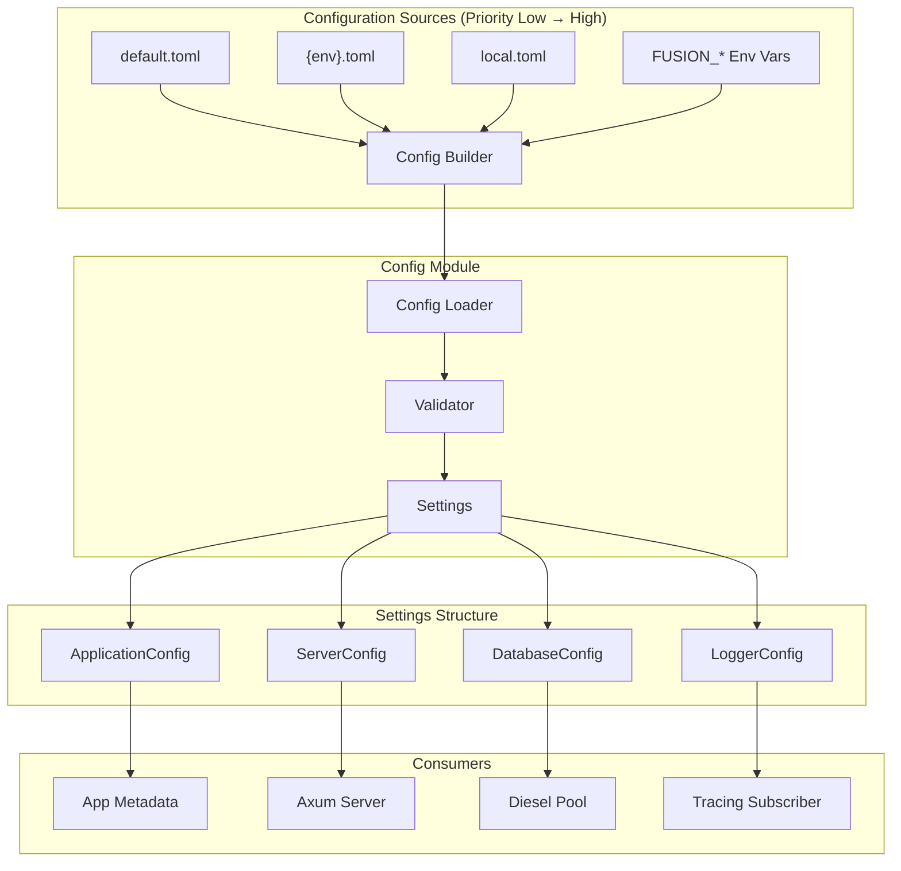
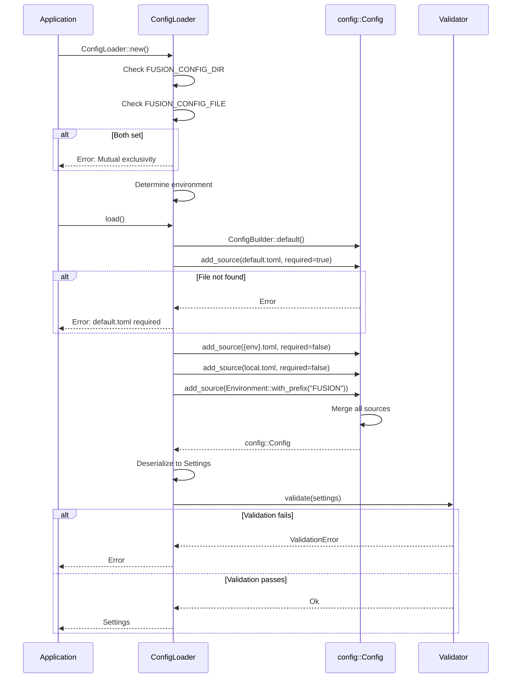

# Design Document: Config Management

## Overview

本设计文档描述 fusion-rs 项目的配置管理模块实现。该模块基于 `config` crate 实现分层配置加载，支持 TOML 格式配置文件、环境变量覆盖，以及多环境配置管理。

配置管理模块将位于 `src/config/` 目录下，提供类型安全的配置访问接口，并与现有的 `LoggerConfig` 结构无缝集成。

## Architecture



## Components and Interfaces

### 1. Settings (主配置结构)

```rust
use serde::{Deserialize, Serialize};

/// 应用程序完整配置
#[derive(Debug, Clone, Serialize, Deserialize)]
pub struct Settings {
    pub application: ApplicationConfig,
    pub server: ServerConfig,
    pub database: DatabaseConfig,
    pub logger: LoggerSettings,
}

impl Settings {
    /// 从配置源加载设置
    pub fn load() -> Result<Self, ConfigError>;
    
    /// 验证配置
    pub fn validate(&self) -> Result<(), ConfigError>;
    
    /// 获取当前环境
    pub fn environment() -> Environment;
}
```

### 2. ApplicationConfig (应用配置)

```rust
#[derive(Debug, Clone, Serialize, Deserialize)]
pub struct ApplicationConfig {
    /// 应用名称
    #[serde(default = "default_app_name")]
    pub name: String,
    
    /// 应用版本
    #[serde(default = "default_app_version")]
    pub version: String,
}

fn default_app_name() -> String {
    "fusion-rs".to_string()
}

fn default_app_version() -> String {
    "0.1.0".to_string()
}
```

### 3. ServerConfig (服务器配置)

```rust
#[derive(Debug, Clone, Serialize, Deserialize)]
pub struct ServerConfig {
    /// 监听地址
    #[serde(default = "default_host")]
    pub host: String,
    
    /// 监听端口
    #[serde(default = "default_port")]
    pub port: u16,
    
    /// 请求超时时间（秒）
    #[serde(default = "default_request_timeout")]
    pub request_timeout: u64,
    
    /// Keep-alive 超时时间（秒）
    #[serde(default = "default_keep_alive_timeout")]
    pub keep_alive_timeout: u64,
}

impl ServerConfig {
    /// 获取完整的监听地址
    pub fn address(&self) -> String {
        format!("{}:{}", self.host, self.port)
    }
    
    /// 验证服务器配置
    pub fn validate(&self) -> Result<(), ConfigError>;
}
```

### 4. DatabaseConfig (数据库配置)

```rust
#[derive(Debug, Clone, Serialize, Deserialize)]
pub struct DatabaseConfig {
    /// 数据库连接 URL
    pub url: String,
    
    /// 最大连接数
    #[serde(default = "default_max_connections")]
    pub max_connections: u32,
    
    /// 最小连接数
    #[serde(default = "default_min_connections")]
    pub min_connections: u32,
    
    /// 连接超时时间（秒）
    #[serde(default = "default_connection_timeout")]
    pub connection_timeout: u64,
}

impl DatabaseConfig {
    /// 验证数据库配置
    pub fn validate(&self) -> Result<(), ConfigError>;
}
```

### 5. LoggerSettings (日志配置)

```rust
/// 日志配置（与现有 LoggerConfig 兼容）
#[derive(Debug, Clone, Serialize, Deserialize)]
pub struct LoggerSettings {
    #[serde(default = "default_log_level")]
    pub level: String,
    
    #[serde(default)]
    pub console: ConsoleSettings,
    
    #[serde(default)]
    pub file: FileSettings,
}

#[derive(Debug, Clone, Serialize, Deserialize)]
pub struct ConsoleSettings {
    #[serde(default = "default_true")]
    pub enabled: bool,
    
    #[serde(default = "default_true")]
    pub colored: bool,
}

#[derive(Debug, Clone, Serialize, Deserialize)]
pub struct FileSettings {
    #[serde(default)]
    pub enabled: bool,
    
    #[serde(default = "default_log_path")]
    pub path: String,
    
    #[serde(default = "default_true")]
    pub append: bool,
    
    #[serde(default = "default_log_format")]
    pub format: String,
    
    #[serde(default)]
    pub rotation: RotationSettings,
}

impl LoggerSettings {
    /// 转换为 LoggerConfig
    pub fn into_logger_config(self) -> Result<LoggerConfig, ConfigError>;
}
```

### 6. Environment (环境枚举)

```rust
#[derive(Debug, Clone, Copy, PartialEq, Eq, Serialize, Deserialize)]
#[serde(rename_all = "lowercase")]
pub enum Environment {
    Development,
    Test,
    Staging,
    Production,
}

impl Environment {
    /// 从环境变量获取当前环境
    pub fn from_env() -> Self;
    
    /// 转换为字符串
    pub fn as_str(&self) -> &'static str;
}

impl Default for Environment {
    fn default() -> Self {
        Environment::Development
    }
}

impl std::str::FromStr for Environment {
    type Err = ConfigError;
    
    fn from_str(s: &str) -> Result<Self, Self::Err>;
}
```

### 7. ConfigError (错误类型)

```rust
use thiserror::Error;

#[derive(Debug, Error)]
pub enum ConfigError {
    #[error("Configuration file not found: {0}")]
    FileNotFound(String),
    
    #[error("Failed to parse configuration: {0}")]
    ParseError(String),
    
    #[error("Validation error: {field} - {message}")]
    ValidationError { field: String, message: String },
    
    #[error("Environment variable error: {0}")]
    EnvVarError(String),
    
    #[error("Mutual exclusivity error: {0}")]
    MutualExclusivityError(String),
    
    #[error("Configuration error: {0}")]
    Other(#[from] config::ConfigError),
}
```

### 8. ConfigLoader (配置加载器)

```rust
/// 配置加载器
pub struct ConfigLoader {
    config_dir: PathBuf,
    config_file: Option<PathBuf>,
    environment: Environment,
}

impl ConfigLoader {
    /// 创建新的配置加载器
    pub fn new() -> Result<Self, ConfigError>;
    
    /// 加载配置
    pub fn load(&self) -> Result<Settings, ConfigError>;
    
    /// 构建 config::Config 实例
    fn build_config(&self) -> Result<config::Config, ConfigError>;
    
    /// 添加配置文件源
    fn add_file_source(
        builder: ConfigBuilder,
        path: &Path,
        required: bool,
    ) -> Result<ConfigBuilder, ConfigError>;
    
    /// 添加环境变量源
    fn add_env_source(builder: ConfigBuilder) -> ConfigBuilder;
}
```

## Data Models

### 配置文件结构 (TOML)

```toml
# config/default.toml

[application]
name = "fusion-rs"
version = "0.1.0"

[server]
host = "127.0.0.1"
port = 3000
request_timeout = 30
keep_alive_timeout = 75

[database]
url = "postgres://localhost/fusion_dev"
max_connections = 10
min_connections = 1
connection_timeout = 30

[logger]
level = "info"

[logger.console]
enabled = true
colored = true

[logger.file]
enabled = false
path = "logs/app.log"
append = true
format = "json"

[logger.file.rotation]
strategy = "size"
max_size = 10485760  # 10MB
max_files = 5
compress = false
```

### 环境变量映射

| 环境变量 | 配置路径 | 示例值 |
|---------|---------|--------|
| `FUSION_APP_ENV` | (特殊) | `production` |
| `FUSION_CONFIG_DIR` | (特殊) | `/etc/fusion` |
| `FUSION_CONFIG_FILE` | (特殊) | `/etc/fusion/config.toml` |
| `FUSION_APPLICATION__NAME` | `application.name` | `my-app` |
| `FUSION_SERVER__HOST` | `server.host` | `0.0.0.0` |
| `FUSION_SERVER__PORT` | `server.port` | `8080` |
| `FUSION_DATABASE__URL` | `database.url` | `postgres://...` |
| `FUSION_LOGGER__LEVEL` | `logger.level` | `debug` |


## Module Structure

```
src/config/
├── mod.rs           # 模块导出
├── settings.rs      # Settings 及子配置结构
├── loader.rs        # ConfigLoader 实现
├── error.rs         # ConfigError 定义
├── environment.rs   # Environment 枚举
└── validation.rs    # 验证逻辑
```

## Configuration Loading Flow



## Validation Rules

### ServerConfig Validation

| Field | Rule | Error Message |
|-------|------|---------------|
| `port` | 1 ≤ port ≤ 65535 | "Port must be between 1 and 65535" |
| `request_timeout` | > 0 | "Request timeout must be greater than 0" |
| `keep_alive_timeout` | > 0 | "Keep-alive timeout must be greater than 0" |

### DatabaseConfig Validation

| Field | Rule | Error Message |
|-------|------|---------------|
| `url` | Non-empty | "Database URL is required" |
| `url` | Valid format | "Invalid database URL format" |
| `max_connections` | > 0 | "Max connections must be greater than 0" |
| `min_connections` | > 0 | "Min connections must be greater than 0" |
| `min_connections` | ≤ max_connections | "Min connections cannot exceed max connections" |

### LoggerSettings Validation

| Field | Rule | Error Message |
|-------|------|---------------|
| `level` | Valid level | "Invalid log level" |
| `file.path` | Non-empty if enabled | "File path required when file logging enabled" |
| `file.format` | Valid format | "Invalid log format" |


## Correctness Properties

*A property is a characteristic or behavior that should hold true across all valid executions of a system—essentially, a formal statement about what the system should do. Properties serve as the bridge between human-readable specifications and machine-verifiable correctness guarantees.*

### Property 1: Configuration Precedence

*For any* configuration key that exists in multiple sources (default.toml, environment.toml, local.toml, environment variables), the final value SHALL be from the highest priority source, where priority is: environment variables > local.toml > {env}.toml > default.toml.

**Validates: Requirements 1.1, 1.2**

### Property 2: Optional File Graceful Handling

*For any* configuration loading scenario where environment-specific or local configuration files do not exist, the Config_Manager SHALL successfully load configuration using only the available sources without returning an error.

**Validates: Requirements 1.4**

### Property 3: Environment-Based File Loading

*For any* valid environment value (development, test, staging, production), when that environment is set via `FUSION_APP_ENV`, the Config_Manager SHALL construct the correct file path `{config_dir}/{environment}.toml` and attempt to load it.

**Validates: Requirements 2.1, 2.4**

### Property 4: Environment Variable Mapping

*For any* environment variable with prefix `FUSION_` and double underscore separators, the Config_Manager SHALL correctly map it to the corresponding nested configuration path (e.g., `FUSION_SERVER__PORT` → `server.port`).

**Validates: Requirements 4.1, 4.2, 4.3**

### Property 5: Logger Settings Conversion

*For any* valid LoggerSettings instance loaded from configuration, converting it to LoggerConfig SHALL produce a valid LoggerConfig that passes validation.

**Validates: Requirements 8.3**

### Property 6: Configuration Validation

*For any* Settings instance, validation SHALL reject configurations where:
- `server.port` is outside range 1-65535
- `database.url` is empty or invalid format
- `database.min_connections` > `database.max_connections`
- Required fields are missing

**Validates: Requirements 9.1, 9.2, 9.4, 9.5**

### Property 7: Settings Round-Trip Serialization

*For any* valid Settings instance, serializing to TOML and then deserializing back SHALL produce an equivalent Settings instance.

**Validates: Requirements 10.4**

## Error Handling

### Error Categories

| Category | Error Type | Recovery Strategy |
|----------|-----------|-------------------|
| File Not Found | `ConfigError::FileNotFound` | Fail for required files, skip for optional |
| Parse Error | `ConfigError::ParseError` | Fail with detailed error message |
| Validation Error | `ConfigError::ValidationError` | Fail with field name and reason |
| Env Var Error | `ConfigError::EnvVarError` | Fail with variable name and expected type |
| Mutual Exclusivity | `ConfigError::MutualExclusivityError` | Fail with explanation |

### Error Messages

All error messages SHALL:
1. Identify the specific field or file causing the error
2. Explain what was expected vs. what was found
3. Suggest corrective action when possible

Example:
```
ValidationError: server.port - Port value 70000 is outside valid range (1-65535). 
Please specify a port between 1 and 65535.
```

## Testing Strategy

### Unit Tests

Unit tests will cover:
- Default value verification for all configuration fields
- Individual validation rules
- Environment parsing
- Error message formatting
- Specific edge cases (empty strings, boundary values)

### Property-Based Tests

Property-based tests will use the `proptest` crate (already in dev-dependencies) to verify:

1. **Configuration Precedence** - Generate random config values across layers, verify merge behavior
2. **Environment Variable Mapping** - Generate valid env var names, verify path mapping
3. **Validation Rejection** - Generate invalid values, verify rejection
4. **Round-Trip Serialization** - Generate valid Settings, verify serialize/deserialize equivalence

Each property test will run minimum 100 iterations.

### Test Configuration

```rust
// Property test annotation format
// Feature: config-management, Property 1: Configuration Precedence
#[test]
fn prop_configuration_precedence() {
    // ...
}
```

### Test File Structure

```
src/config/
├── tests.rs              # Unit tests
└── tests/
    └── property_tests.rs # Property-based tests
```
