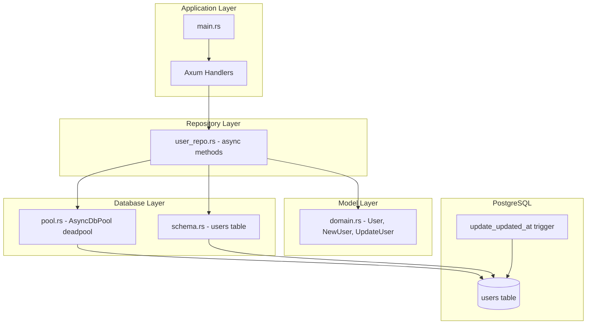

# Design Document

## Overview

本设计文档描述如何在 Rust 项目中集成 diesel_async 与 PostgreSQL，实现 User 表的完整异步数据访问层。使用 diesel_async 可以与 Axum + Tokio 异步运行时无缝集成，避免在异步上下文中阻塞线程。设计遵循分层架构原则，将数据库连接、模型定义、仓储操作分离到独立模块中。

## Architecture



## Dependencies

```toml
[dependencies]
# Diesel core (同步部分，用于 schema 和 model 定义)
diesel = { version = "2.2", features = ["postgres"] }

# Diesel async 扩展
diesel-async = { version = "0.5", features = ["postgres", "bb8"] }

# 环境变量加载
dotenvy = "0.15"

# 错误处理
thiserror = "1.0"
```

## Components and Interfaces

### 1. Database Connection Pool (src/db/pool.rs)

```rust
use diesel_async::pooled_connection::bb8::Pool;
use diesel_async::pooled_connection::AsyncDieselConnectionManager;
use diesel_async::AsyncPgConnection;

/// 异步连接池类型别名
/// bb8::Pool 内部使用 Arc，Clone 是廉价的引用计数增加
pub type AsyncDbPool = Pool<AsyncPgConnection>;

/// 创建异步数据库连接池
pub async fn establish_async_connection_pool() -> Result<AsyncDbPool, AppError> {
    let database_url = std::env::var("DATABASE_URL")?;
    let config = AsyncDieselConnectionManager::<AsyncPgConnection>::new(database_url);
    let pool = Pool::builder().build(config).await?;
    Ok(pool)
}
```

> **设计说明**: `bb8::Pool` 内部使用 `Arc` 实现，因此 `AsyncDbPool::clone()` 只是增加引用计数，非常廉价。持有 `AsyncDbPool` 的结构体可以直接 derive `Clone`，无需额外的 `Arc` 包装。bb8 的 `build()` 方法是异步的，需要在异步上下文中调用。

### 2. User Models (src/models/domain.rs)

```rust
use chrono::NaiveDateTime;
use diesel::prelude::*;
use serde::{Deserialize, Serialize};

// 查询用 - 从数据库读取
#[derive(Debug, Queryable, Selectable, Serialize, Clone)]
#[diesel(table_name = crate::schema::users)]
#[diesel(check_for_backend(diesel::pg::Pg))]
pub struct User {
    pub id: i32,
    pub username: String,
    pub email: String,
    pub password: String,
    pub created_at: NaiveDateTime,
    pub updated_at: NaiveDateTime,
}

// 插入用 - 创建新记录
#[derive(Debug, Insertable, Deserialize, Clone)]
#[diesel(table_name = crate::schema::users)]
pub struct NewUser {
    pub username: String,
    pub email: String,
    pub password: String,
}

// 更新用 - 部分更新
#[derive(Debug, AsChangeset, Deserialize, Clone, Default)]
#[diesel(table_name = crate::schema::users)]
pub struct UpdateUser {
    pub username: Option<String>,
    pub email: Option<String>,
    pub password: Option<String>,
}
```

### 3. User Repository (src/repositories/user_repo.rs)

```rust
use diesel::prelude::*;
use diesel_async::RunQueryDsl;

/// UserRepository 持有异步连接池
/// 
/// 由于 AsyncDbPool (deadpool::Pool) 内部使用 Arc，Clone 只是引用计数增加
/// 因此无需 Arc<UserRepository>，直接 Clone 即可在多个 handler 间共享
#[derive(Clone)]
pub struct UserRepository {
    pool: AsyncDbPool,
}

impl UserRepository {
    pub fn new(pool: AsyncDbPool) -> Self {
        Self { pool }
    }
    
    /// 创建新用户
    pub async fn create(&self, new_user: NewUser) -> Result<User, AppError> {
        use crate::schema::users::dsl::*;
        let mut conn = self.pool.get().await?;
        
        diesel::insert_into(users)
            .values(&new_user)
            .returning(User::as_returning())
            .get_result(&mut conn)
            .await
            .map_err(AppError::from)
    }
    
    /// 根据 ID 查询用户
    pub async fn find_by_id(&self, user_id: i32) -> Result<Option<User>, AppError> {
        use crate::schema::users::dsl::*;
        let mut conn = self.pool.get().await?;
        
        users
            .filter(id.eq(user_id))
            .select(User::as_select())
            .first(&mut conn)
            .await
            .optional()
            .map_err(AppError::from)
    }
    
    /// 根据 Email 查询用户
    pub async fn find_by_email(&self, user_email: &str) -> Result<Option<User>, AppError> {
        use crate::schema::users::dsl::*;
        let mut conn = self.pool.get().await?;
        
        users
            .filter(email.eq(user_email))
            .select(User::as_select())
            .first(&mut conn)
            .await
            .optional()
            .map_err(AppError::from)
    }
    
    /// 获取所有用户
    pub async fn list_all(&self) -> Result<Vec<User>, AppError> {
        use crate::schema::users::dsl::*;
        let mut conn = self.pool.get().await?;
        
        users
            .select(User::as_select())
            .load(&mut conn)
            .await
            .map_err(AppError::from)
    }
    
    /// 更新用户
    pub async fn update(&self, user_id: i32, update_data: UpdateUser) -> Result<User, AppError> {
        use crate::schema::users::dsl::*;
        let mut conn = self.pool.get().await?;
        
        diesel::update(users.filter(id.eq(user_id)))
            .set(&update_data)
            .returning(User::as_returning())
            .get_result(&mut conn)
            .await
            .map_err(AppError::from)
    }
    
    /// 删除用户
    pub async fn delete(&self, user_id: i32) -> Result<usize, AppError> {
        use crate::schema::users::dsl::*;
        let mut conn = self.pool.get().await?;
        
        diesel::delete(users.filter(id.eq(user_id)))
            .execute(&mut conn)
            .await
            .map_err(AppError::from)
    }
}
```

### 4. Repositories Aggregate (src/repositories/mod.rs)

```rust
/// 聚合所有 Repository，便于作为 Axum State 共享
#[derive(Clone)]
pub struct Repositories {
    pub users: UserRepository,
}

impl Repositories {
    pub fn new(pool: AsyncDbPool) -> Self {
        Self {
            users: UserRepository::new(pool.clone()),
        }
    }
}
```

**Axum 集成示例：**
```rust
// 在 main.rs 或 routes.rs 中
let pool = establish_async_connection_pool().await?;
let repos = Repositories::new(pool);

let app = Router::new()
    .route("/users", get(list_users).post(create_user))
    .with_state(repos);

// Handler 中使用 - 完全异步，无需 spawn_blocking
async fn list_users(State(repos): State<Repositories>) -> impl IntoResponse {
    match repos.users.list_all().await {
        Ok(users) => Json(users).into_response(),
        Err(e) => (StatusCode::INTERNAL_SERVER_ERROR, e.to_string()).into_response(),
    }
}

async fn create_user(
    State(repos): State<Repositories>,
    Json(new_user): Json<NewUser>,
) -> impl IntoResponse {
    match repos.users.create(new_user).await {
        Ok(user) => (StatusCode::CREATED, Json(user)).into_response(),
        Err(e) => (StatusCode::BAD_REQUEST, e.to_string()).into_response(),
    }
}
```

### 5. Error Types (src/error/app_error.rs)

```rust
use thiserror::Error;

#[derive(Debug, Error)]
pub enum AppError {
    #[error("Database error: {0}")]
    Database(#[from] diesel::result::Error),
    
    #[error("Connection pool error: {0}")]
    Pool(#[from] bb8::RunError<diesel_async::pooled_connection::PoolError>),
    
    #[error("Environment error: {0}")]
    Env(#[from] std::env::VarError),
    
    #[error("User not found")]
    NotFound,
}
```

## Data Models

### Database Schema (PostgreSQL)

```sql
CREATE TABLE users (
    id SERIAL PRIMARY KEY,
    username VARCHAR(255) NOT NULL,
    email VARCHAR(255) NOT NULL UNIQUE,
    password VARCHAR(255) NOT NULL,
    created_at TIMESTAMP NOT NULL DEFAULT CURRENT_TIMESTAMP,
    updated_at TIMESTAMP NOT NULL DEFAULT CURRENT_TIMESTAMP
);

-- 自动更新 updated_at 的触发器函数
CREATE OR REPLACE FUNCTION update_updated_at_column()
RETURNS TRIGGER AS $$
BEGIN
    NEW.updated_at = CURRENT_TIMESTAMP;
    RETURN NEW;
END;
$$ language 'plpgsql';

-- 绑定触发器到 users 表
CREATE TRIGGER update_users_updated_at
    BEFORE UPDATE ON users
    FOR EACH ROW
    EXECUTE FUNCTION update_updated_at_column();
```

### Diesel Schema (src/schema.rs)

```rust
// 由 diesel print-schema 自动生成
diesel::table! {
    users (id) {
        id -> Int4,
        username -> Varchar,
        email -> Varchar,
        password -> Varchar,
        created_at -> Timestamp,
        updated_at -> Timestamp,
    }
}
```

### Type Mappings

| PostgreSQL Type | Diesel Type | Rust Type |
|-----------------|-------------|-----------|
| SERIAL | Int4 | i32 |
| VARCHAR(255) | Varchar | String |
| TIMESTAMP | Timestamp | chrono::NaiveDateTime |

## Correctness Properties

*A property is a characteristic or behavior that should hold true across all valid executions of a system—essentially, a formal statement about what the system should do. Properties serve as the bridge between human-readable specifications and machine-verifiable correctness guarantees.*

### Property 1: Create-Read Round Trip

*For any* valid NewUser input (with non-empty username, unique email, and non-empty password), creating a user and then reading it by the returned id should produce a User with matching username, email, and password fields.

**Validates: Requirements 6.1, 6.2**

### Property 2: Find by Email Consistency

*For any* created User, querying by that user's email should return Some(User) with data matching the original creation input.

**Validates: Requirements 6.3**

### Property 3: List Contains All Created Users

*For any* set of created Users, calling list_all should return a Vec containing all created users (list length >= number of users created in test).

**Validates: Requirements 6.4**

### Property 4: Update Preserves Unmodified Fields

*For any* existing User and UpdateUser with only some fields set (e.g., only username), updating the user should change only the specified fields while preserving all unspecified fields (email, password remain unchanged).

**Validates: Requirements 6.5**

### Property 5: Delete Removes Record

*For any* existing User, after successful deletion (returns 1), querying by that user's id should return None.

**Validates: Requirements 6.6, 6.2**

### Property 6: Email Uniqueness Constraint

*For any* two NewUser inputs with identical email addresses, the second create operation should fail with a database constraint violation error.

**Validates: Requirements 2.3**

### Property 7: Timestamp Auto-Generation on Create

*For any* newly created User, the created_at and updated_at fields should be automatically populated with non-null timestamps that are close to the current time (within reasonable tolerance).

**Validates: Requirements 2.5, 2.6**

### Property 8: Timestamp Auto-Update on Modify

*For any* existing User, after an update operation, the updated_at timestamp should be greater than or equal to the original updated_at value.

**Validates: Requirements 2.7**

## Error Handling

| Operation | Error Condition | Handling Strategy |
|-----------|-----------------|-------------------|
| Connection Pool Init | DATABASE_URL not set | Return Env error with descriptive message |
| Connection Pool Init | Invalid connection string | Return Pool error |
| Get Connection | Pool exhausted | Return Pool error with timeout info |
| Create User | Duplicate email | Return Database error (UniqueViolation) |
| Create User | Invalid data | Return Database error |
| Find User | Not found | Return Ok(None) |
| Update User | Not found | Return NotFound error |
| Delete User | Not found | Return Ok(0) affected rows |

## Testing Strategy

### Unit Tests

- 测试模型的序列化/反序列化
- 测试错误类型的转换
- 测试连接池配置验证

### Property-Based Tests

使用 `proptest` 框架验证正确性属性，每个测试最少运行 100 次迭代：

1. **Property 1 (Create-Read Round Trip)**: 生成随机 NewUser，验证创建后通过 id 读取的数据一致性
2. **Property 2 (Find by Email)**: 生成随机 NewUser，验证创建后通过 email 查询的数据一致性
3. **Property 3 (List All)**: 生成随机数量的 NewUser，验证 list_all 返回所有创建的用户
4. **Property 4 (Update Preservation)**: 生成随机 User 和部分 UpdateUser，验证未修改字段保持不变
5. **Property 5 (Delete)**: 生成随机 User，验证删除后查询返回 None
6. **Property 6 (Email Uniqueness)**: 生成两个相同 email 的 NewUser，验证第二次创建失败
7. **Property 7 (Timestamp Generation)**: 生成随机 NewUser，验证时间戳自动填充
8. **Property 8 (Timestamp Update)**: 生成随机 User 并更新，验证 updated_at 时间戳更新

测试标注格式: `// Feature: diesel-user-integration, Property N: [property description]`

### Integration Tests

- 测试完整的 CRUD 流程
- 测试数据库触发器的 updated_at 自动更新
- 测试并发操作下的连接池行为

### Test Configuration

- Property tests: 最少 100 次迭代
- 使用 testcontainers 或独立测试数据库
- 每个测试用例后清理数据
- 异步测试使用 `#[tokio::test]` 宏
