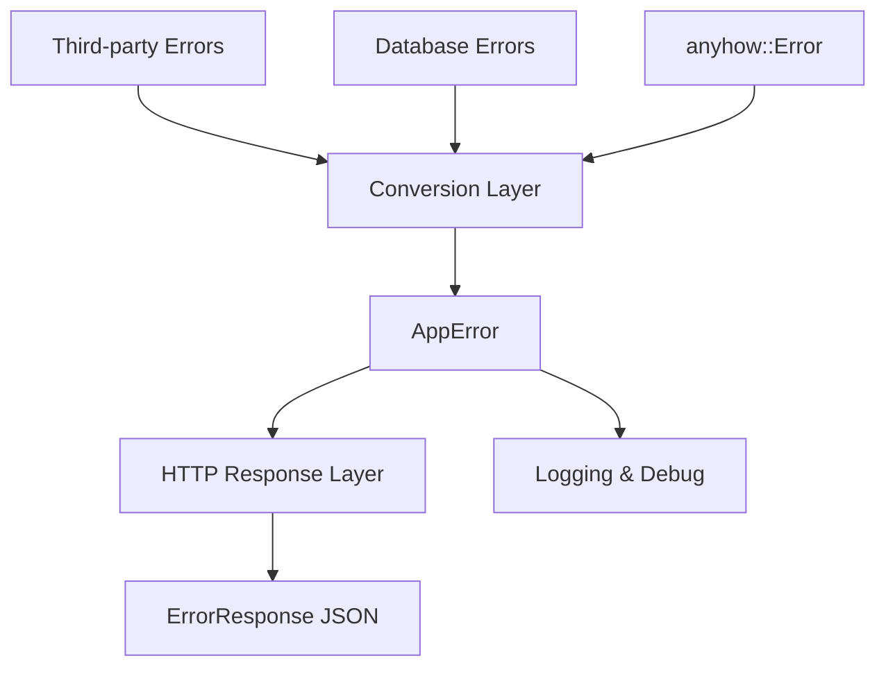

# Design Document: Error Handling System Redesign

## Overview

This design document outlines a comprehensive error handling system for the Rust web application that provides structured error types, automatic database error conversion, and seamless integration with anyhow. The system will replace the current basic AppError implementation with a more robust and feature-rich error handling approach.

## Architecture

The error handling system follows a layered architecture:

1. **Core Error Types Layer**: Defines the main AppError enum with structured variants
2. **Conversion Layer**: Handles automatic conversion from database and third-party errors
3. **HTTP Response Layer**: Converts AppError to appropriate HTTP responses
4. **Integration Layer**: Provides anyhow integration and utility types



## Components and Interfaces

### AppError Enum

The core error type that represents all possible application errors:

```rust
#[derive(Debug, thiserror::Error)]
pub enum AppError {
    #[error("Resource not found: {entity} with {field}={value}")]
    NotFound {
        entity: String,
        field: String,
        value: String,
    },
    
    #[error("Duplicate entry: {entity}.{field} = '{value}' already exists")]
    Duplicate {
        entity: String,
        field: String,
        value: String,
    },
    
    #[error("Validation failed for {field}: {reason}")]
    Validation {
        field: String,
        reason: String,
    },
    
    #[error("Bad request: {message}")]
    BadRequest {
        message: String,
    },
    
    #[error("Unprocessable content: {message}")]
    UnprocessableContent {
        message: String,
    },
    
    #[error("Unauthorized: {message}")]
    Unauthorized {
        message: String,
    },
    
    #[error("Forbidden: {message}")]
    Forbidden {
        message: String,
    },
    
    #[error("Database operation failed: {operation}")]
    Database {
        operation: String,
        #[source]
        source: anyhow::Error,
    },
    
    #[error("Configuration error: {key}")]
    Configuration {
        key: String,
        #[source]
        source: anyhow::Error,
    },
    
    #[error("Connection pool error")]
    ConnectionPool {
        #[source]
        source: anyhow::Error,
    },
    
    #[error("Internal error")]
    Internal {
        #[source]
        source: anyhow::Error,
    },
}
```

### AppResult Type Alias

A convenience type alias for Result with AppError:

```rust
pub type AppResult<T> = Result<T, AppError>;
```

### ErrorResponse DTO

Enhanced error response structure for HTTP APIs:

```rust
#[derive(Debug, Serialize, Deserialize)]
pub struct ErrorResponse {
    pub code: String,
    pub message: String,
    #[serde(skip_serializing_if = "Option::is_none")]
    pub details: Option<serde_json::Value>,
    #[serde(skip_serializing_if = "Option::is_none")]
    pub request_id: Option<String>,
}
```

The `details` field uses `serde_json::Value` to provide maximum flexibility for different error contexts:
- For validation errors: `{"field": "email", "reason": "invalid format"}`
- For duplicate errors: `{"entity": "user", "field": "email", "value": "john@example.com"}`
- For not found errors: `{"entity": "user", "field": "id", "value": "123"}`
- For custom error contexts: any JSON structure as needed

Helper methods will be provided for common error detail patterns:

```rust
impl ErrorResponse {
    pub fn new(code: &str, message: &str) -> Self { /* ... */ }
    
    pub fn with_details(mut self, details: serde_json::Value) -> Self { /* ... */ }
    
    pub fn with_request_id(mut self, request_id: &str) -> Self { /* ... */ }
    
    // Convenience methods for common error patterns
    pub fn validation_error(field: &str, reason: &str) -> Self { /* ... */ }
    
    pub fn not_found_error(entity: &str, field: &str, value: &str) -> Self { /* ... */ }
    
    pub fn duplicate_error(entity: &str, field: &str, value: &str) -> Self { /* ... */ }
}
```

### Database Error Converter

A utility module for converting Diesel errors to structured AppError variants:

```rust
pub struct DatabaseErrorConverter;

impl DatabaseErrorConverter {
    pub fn convert_diesel_error(error: diesel::result::Error, operation: &str) -> AppError {
        match error {
            diesel::result::Error::DatabaseError(kind, info) => {
                Self::convert_database_error(kind, info, operation)
            }
            diesel::result::Error::NotFound => AppError::NotFound {
                entity: "resource".to_string(),
                field: "id".to_string(),
                value: "unknown".to_string(),
            },
            other => AppError::Database {
                operation: operation.to_string(),
                source: anyhow::Error::from(other),
            },
        }
    }
    
    fn convert_database_error(
        kind: diesel::result::DatabaseErrorKind,
        info: Box<dyn diesel::result::DatabaseErrorInformation + Send + Sync>,
        operation: &str,
    ) -> AppError {
        // Implementation details for constraint violation parsing
    }
}
```

## Data Models

### Error Classification

Errors are classified into the following categories:

1. **Client Errors (4xx)**:
   - `NotFound`: Resource doesn't exist (404)
   - `Duplicate`: Unique constraint violation (409)
   - `Validation`: Input validation failure (400)
   - `BadRequest`: Malformed or invalid request (400)
   - `UnprocessableContent`: Valid request but cannot be processed (422)
   - `Unauthorized`: Authentication required or failed (401)
   - `Forbidden`: Access denied for authenticated user (403)

2. **Server Errors (5xx)**:
   - `Database`: Database operation failure (500)
   - `Configuration`: Missing or invalid configuration (500)
   - `ConnectionPool`: Database connection issues (503)
   - `Internal`: Unexpected internal errors (500)

### Error Context Structure

Each error variant carries specific contextual information:

- **NotFound**: entity type, search field, search value
- **Duplicate**: entity type, conflicting field, conflicting value
- **Validation**: field name, validation failure reason
- **BadRequest**: descriptive error message
- **UnprocessableContent**: descriptive error message
- **Unauthorized**: authentication failure message
- **Forbidden**: access denial message
- **Database**: operation description, underlying error
- **Configuration**: configuration key, underlying error
- **ConnectionPool**: underlying connection error
- **Internal**: wrapped anyhow error with full context

## Data Models

### Constraint Violation Parsing

The system will parse database constraint violation messages to extract structured information:

```rust
pub struct ConstraintParser;

impl ConstraintParser {
    pub fn parse_unique_violation(message: &str) -> Option<(String, String, String)> {
        // Parse PostgreSQL unique constraint violation messages
        // Returns (entity, field, value) tuple
    }
    
    pub fn parse_not_null_violation(message: &str) -> Option<(String, String)> {
        // Parse PostgreSQL not null constraint violation messages
        // Returns (entity, field) tuple
    }
    
    pub fn parse_foreign_key_violation(message: &str) -> Option<(String, String, String)> {
        // Parse PostgreSQL foreign key constraint violation messages
        // Returns (entity, field, referenced_value) tuple
    }
}
```

## Correctness Properties

*A property is a characteristic or behavior that should hold true across all valid executions of a system-essentially, a formal statement about what the system should do. Properties serve as the bridge between human-readable specifications and machine-verifiable correctness guarantees.*

After analyzing the acceptance criteria, I've identified several redundant properties that can be consolidated:

**Property Reflection:**
- Properties 1.1, 3.2 (Duplicate error structure) can be combined
- Properties 1.2, 3.1 (NotFound error structure) can be combined  
- Properties 1.3, 3.3 (Validation error structure) can be combined
- Properties 1.6, 5.1 (anyhow conversion) are identical
- Properties 4.7, 6.5 (request ID support) are identical
- Properties 5.5, 6.1 (source chain preservation) are identical

### Core Error Structure Properties

**Property 1: AppError variant completeness**
*For any* error scenario (constraint violation, not found, validation, configuration, connection, internal), the AppError enum should have an appropriate variant that can represent that error with all necessary contextual information.
**Validates: Requirements 1.1, 1.2, 1.3, 1.4, 1.5**

**Property 2: NotFound error information completeness**
*For any* NotFound error, it should contain entity type, field name, and search value information.
**Validates: Requirements 1.2, 3.1**

**Property 3: Duplicate error information completeness**
*For any* Duplicate error, it should contain entity type, field name, and conflicting value information.
**Validates: Requirements 1.1, 3.2**

**Property 4: Validation error information completeness**
*For any* Validation error, it should contain field name and validation failure reason.
**Validates: Requirements 1.3, 3.3**

### Database Error Conversion Properties

**Property 5: Unique constraint conversion**
*For any* unique constraint violation from the database, the conversion should produce a Duplicate error with correctly parsed entity, field, and value information.
**Validates: Requirements 2.1**

**Property 6: Not null constraint conversion**
*For any* not null constraint violation from the database, the conversion should produce a Validation error with the correct field information.
**Validates: Requirements 2.2**

**Property 7: Foreign key constraint conversion**
*For any* foreign key constraint violation from the database, the conversion should produce a Validation error with relationship context.
**Validates: Requirements 2.3**

**Property 8: Database connection error conversion**
*For any* database connection error, the conversion should produce a ConnectionPool error with the underlying error preserved.
**Validates: Requirements 2.5**

### Anyhow Integration Properties

**Property 9: Anyhow error conversion**
*For any* anyhow::Error, converting it to AppError should preserve the error message and source chain.
**Validates: Requirements 1.6, 5.1**

**Property 10: Error context preservation**
*For any* error with added context through anyhow methods, converting to AppError should preserve both the original error and the added context.
**Validates: Requirements 5.2, 5.4**

**Property 11: Error source chain preservation**
*For any* nested error chain, the AppError should maintain the complete source chain for debugging purposes.
**Validates: Requirements 5.5, 6.1**

### HTTP Response Conversion Properties

**Property 12: HTTP status code mapping**
*For any* AppError variant, converting to HTTP response should produce the correct status code (NotFound→404, Duplicate→409, Validation/BadRequest→400, UnprocessableContent→422, Unauthorized→401, Forbidden→403, Database/Configuration/Internal→500, ConnectionPool→503).
**Validates: Requirements 4.1, 4.2, 4.3, 4.4, 4.5**

**Property 13: ErrorResponse structure completeness**
*For any* ErrorResponse, it should contain error code, message, and optionally details and request_id fields.
**Validates: Requirements 4.6, 4.7, 6.5**

**Property 14: Error message sanitization**
*For any* internal error converted to ErrorResponse, the message should not expose sensitive internal details while remaining helpful for debugging.
**Validates: Requirements 6.4**

### Serialization Properties

**Property 15: Debug formatting completeness**
*For any* AppError, the Debug format should include all relevant error information for logging purposes.
**Validates: Requirements 7.1**

**Property 16: Display formatting user-friendliness**
*For any* AppError, the Display format should provide user-friendly messages without exposing internal implementation details.
**Validates: Requirements 7.2**

**Property 17: JSON serialization consistency**
*For any* ErrorResponse, serializing to JSON should produce a consistent structure with all required fields.
**Validates: Requirements 7.3**

**Property 18: ErrorResponse round-trip property**
*For any* valid ErrorResponse object, serializing to JSON then deserializing should produce an equivalent object.
**Validates: Requirements 7.5**

## Error Handling

The error handling system itself needs robust error handling for edge cases:

### Constraint Parsing Failures
- When database constraint messages cannot be parsed, fall back to generic Database errors
- Log parsing failures for monitoring and improvement
- Provide reasonable defaults for entity/field/value when parsing fails

### Circular Error Conversion
- Prevent infinite recursion in error conversion chains
- Implement conversion depth limits
- Use simple error variants for conversion failures

### Memory and Performance
- Avoid excessive string allocation in error paths
- Use `Cow<str>` for error messages when appropriate
- Implement efficient constraint message parsing with regex compilation caching

## Testing Strategy

The error handling system will use a dual testing approach combining unit tests and property-based tests:

### Unit Tests
Unit tests will focus on:
- Specific database constraint violation examples
- Known error message formats from PostgreSQL
- Edge cases in constraint parsing
- HTTP response format validation
- Integration points with axum middleware

### Property-Based Tests
Property-based tests will verify universal properties using the `proptest` crate with minimum 100 iterations per test:

- **Error Structure Properties**: Generate random error data and verify all variants contain required information
- **Database Conversion Properties**: Generate various database error scenarios and verify correct conversion
- **HTTP Response Properties**: Generate random AppError instances and verify correct HTTP status codes and response structure
- **Serialization Properties**: Generate random ErrorResponse objects and verify round-trip serialization
- **Anyhow Integration Properties**: Generate nested error chains and verify preservation through conversion

Each property test will be tagged with: **Feature: error-handling-redesign, Property {number}: {property_text}**

The testing strategy ensures comprehensive coverage while maintaining fast feedback cycles during development.